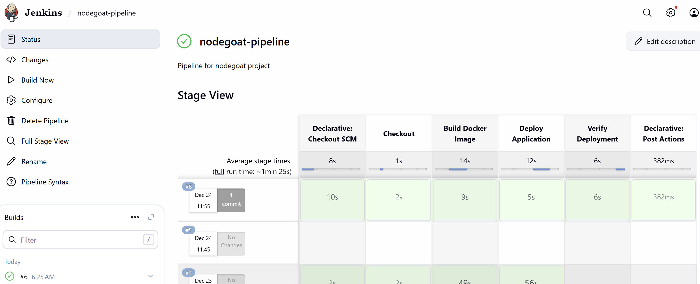
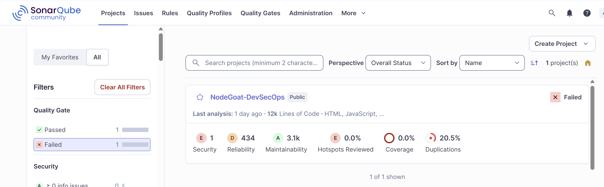
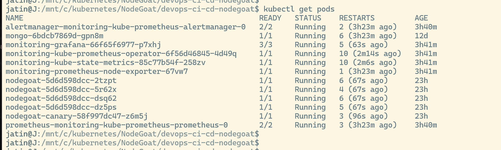
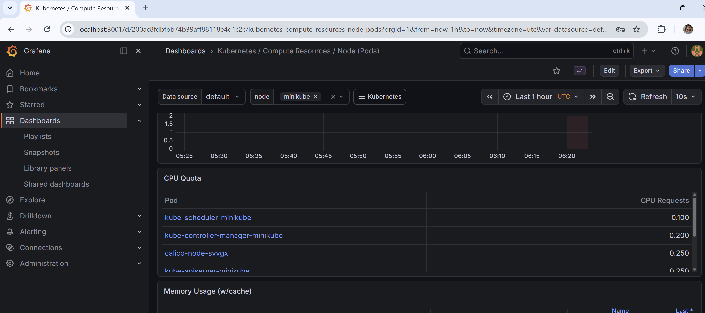
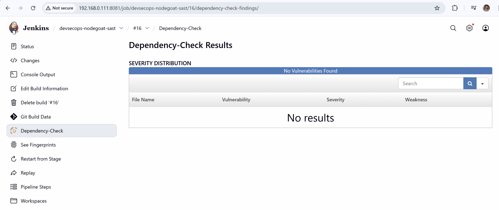
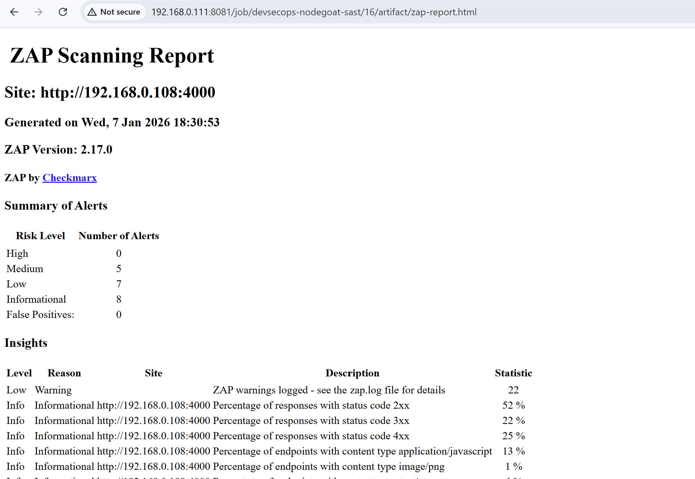

# DevSecOps Kubernetes Platform

This project demonstrates an end-to-end DevSecOps pipeline for deploying a secure NodeJS application using Jenkins, Docker, Kubernetes, and monitoring tools.

---

## Architecture

Terraform → AWS EC2  
Jenkins → CI/CD Pipeline  
Docker → Containerization  
Kubernetes → Deployment Platform  
Prometheus → Metrics Collection  
Grafana → Monitoring Dashboard

---

## Tools Used

Terraform
AWS EC2
Jenkins
Docker
Kubernetes
SonarQube
OWASP Dependency Check
OWASP ZAP
Prometheus
Grafana

---

## CI/CD Pipeline

1. Developer pushes code to GitHub
2. Jenkins pipeline triggers automatically
3. Application is built
4. Security scans executed:
   - SonarQube (SAST)
   - OWASP Dependency Check (SCA)
   - OWASP ZAP (DAST)
5. Docker image is created
6. Application deployed to Kubernetes

---

## Kubernetes Deployment

Components deployed:

NodeGoat Application Deployment  
MongoDB Deployment  
Kubernetes Services  
ConfigMaps and Secrets  
Horizontal Pod Autoscaler  
Canary Deployment

---

## Monitoring

Prometheus collects metrics from the Kubernetes cluster.

Grafana visualizes:

CPU usage  
Memory usage  
Pod health  
Cluster metrics

---

## Screenshots

### Jenkins Pipeline

### SonarQube

### Kubernetes

### Grafana Monitoring

### Dependency Check 

### Prometheus Targets

### ZAP

---

## Outcome

Implemented a complete DevSecOps pipeline integrating infrastructure provisioning, CI/CD automation, container orchestration, security scanning, and monitoring.
